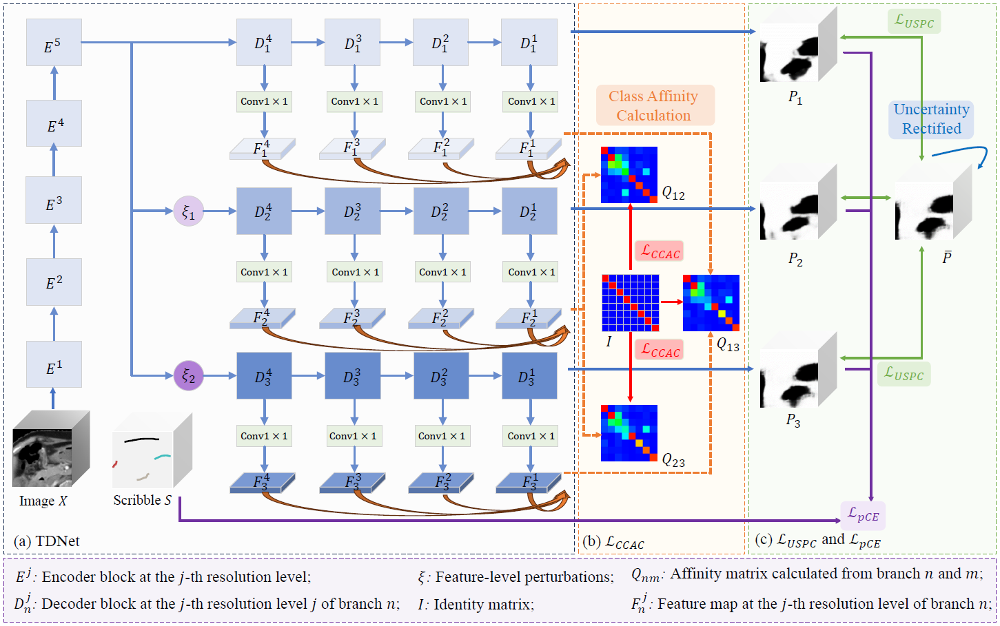

# PS-Seg
Official code for: PS-Seg: Learning from Partial Scribbles for 3D Multiple Abdominal Organ Segmentation

### Overall Framework
The overall framework of PS-Seg：



# Dataset
* The WORD dataset can be downloaded from [WORD](https://github.com/HiLab-git/WORD?tab=readme-ov-file).
* The Synapse dataset can be downloaded from [Synapase](https://www.synapse.org/Synapse:syn3193805/files/)

# Usage with PyMIC
To facilitate the use of code and make it easier to compare with other methods, we have implemented PS-Seg in PyMIC, a Pytorch-based framework for annotation-efficient segmentation. The core modules of PS-Seg in PyMIC can be found [here][pymic_psseg]. It is suggested to use PyMIC for this experiment. In the following, we take the WORD dataset as an example for scribble-supervised segmentation.

[pymic_psseg]: https://github.com/HiLab-git/PyMIC/blob/master/pymic/net_run/weak_sup/wsl_psseg.py

### Step 0: Preparation
#### 0.1. Environment Setup. 
```sh
conda create -n PSSeg python=3.10
conda activate PSSeg
pip install -r requirements.txt
pip install pymic
```
#### 0.2. Dataset processing.
Preprocess WORD dataset by:
```sh
python data/preprocess_WORD.py
```
Generate scribble label by:
```sh
python data/scribble_generator.py
```

To speed up the training process, we convert the data into h5 files by:
```sh
python data/image2h5.py
```

### Step 1: Training 
The configurations including dataset, network, optimizer and hyper-parameters are contained in the configure file
`config/psseg_word.cfg`. Train the PS-Seg model by running:
```sh
python run.py train config/psseg_word.cfg
```

### Step 2: Test
Obtain predictions for testing images:
```
python run.py test config/psseg_word.cfg
```

### Step 3: Compare with other weakly supervised segmentation methods
PyMIC also provides implementation of several other weakly supervised methods (learning from scribbles). Please see [PyMIC_examples/seg_weak_sup/ACDC][PyMIC_example_link] for examples.

[PyMIC_example_link]:https://github.com/HiLab-git/PyMIC_examples/tree/main/seg_weak_sup/ACDC 

### Acknowledgement
The code of scribble-supervised learning framework is borrowed from [WSL4MIS](https://github.com/HiLab-git/WSL4MIS)