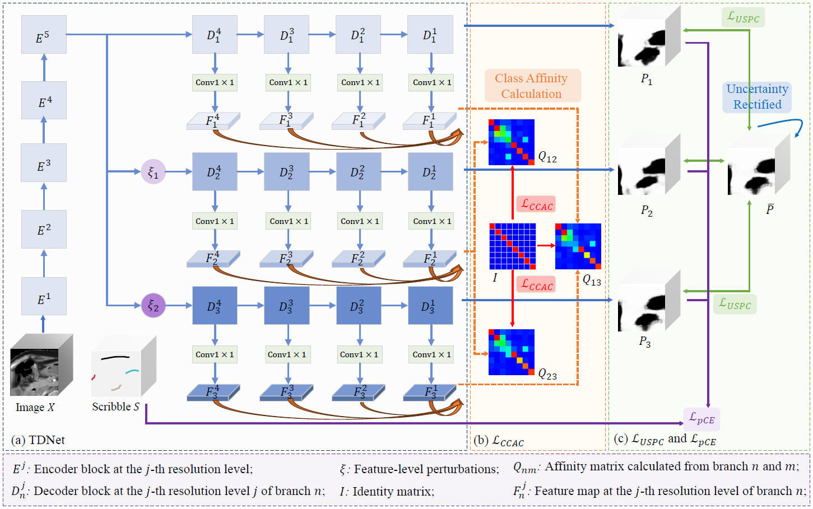

# PS-Seg
This repository provide code and examples of PS-Seg for scribble supervised medical image segmentation, accoding to the following paper:

* Meng Han, Xiaochuan Ma, Xiangde Luo, Wenjun Liao, Shichuan Zhang, Shaoting Zhang,  Guotai Wang, 
[PS-seg: Learning from partial scribbles for 3D multiple abdominal organ segmentation.][paper_link] Neurocomputing, 672, April (2026): 132837. 

[paper_link]: https://www.sciencedirect.com/science/article/pii/S0925231226002341

BibTeX entry:

    @article{han2026ps_seg,
    author = {Meng Han and Xiaochuan Ma and Xiangde Luo and Wenjun Liao and Shichuan Zhang and Shaoting Zhang and  Guotai Wang},
    title = {{PS-seg: Learning from partial scribbles for 3D multiple abdominal organ segmentation}},
    year = {2026},
    url = {https://doi.org/10.1016/j.neucom.2026.132837},
    journal = {Neurocomputing},
    volume = {672},
    pages = {132837},
    }

### Overall Framework
The overall framework of PS-Seg：



# Dataset
* The WORD dataset can be downloaded from [WORD](https://github.com/HiLab-git/WORD?tab=readme-ov-file).
* The Synapse dataset can be downloaded from [Synapase](https://www.synapse.org/Synapse:syn3193805/files/)

# Usage with PyMIC
To facilitate the use of code and make it easier to compare with other methods, we have implemented PS-Seg in PyMIC, a Pytorch-based framework for annotation-efficient segmentation. The core modules of PS-Seg in PyMIC can be found [here][pymic_psseg]. It is suggested to use PyMIC for this experiment. In the following, we take the WORD dataset as an example for scribble-supervised segmentation. 

Both 2D and 3D networks are suported in PyMIC. In this example, we first run with a TDNet_3D that is a 3D multi-branch network, and then demonstrate using a 2D variant. 
[pymic_psseg]: https://github.com/HiLab-git/PyMIC/blob/master/pymic/net_run/weak_sup/wsl_psseg.py

### Step 0: Preparation
#### 0.1. Environment Setup. 
```sh
conda create -n PSSeg python=3.10
conda activate PSSeg
pip install -r requirements.txt
pip install pymic
```
#### 0.2. Dataset processing.
1, Preprocess WORD dataset by cropping with region of interest:
```sh
python data/preprocess_WORD.py
```

2, (optional) The original dataset has provided scribbles for each slice, to simulate sparser scribbles, use the following script to get scribbles in each N slices, e.g., N = 5:
```sh
python data/scribble_generator.py
```

3, To speed up the training process, we convert the data into h5 files with the following script. Note that you may need to change the path of the scribbles. By default, we use the full sribbles in the original dataset. 
```sh
python data/image2h5.py
```

### Step 1: Training 
The configurations including dataset, network, optimizer and hyper-parameters are contained in the configure file
`config/psseg_word.cfg`. PS-Seg needs a multi-decoder network, and it is defined in `networks/TDNet_3D.py`. A reimplementatin of this network has also been provided in PyMIC. 

Train the PS-Seg model by running:
```sh
python run.py train config/psseg_word.cfg
```

### Step 2: Test
Obtain predictions for testing images:
```
python run.py test config/psseg_word.cfg
```

### Step 3: Evaluation
Get quantitative evaluation results by:
```
pymic_eval_seg --metric dice --cls_num 8 --gt_dir ./data/Word_cropWL/labelsTs --seg_dir result/word_psseg
```

### Step 4: Compare with other weakly supervised segmentation methods
PyMIC also provides implementation of several other weakly supervised methods (learning from scribbles), as well as 2D implementation of PS-seg. Please see [PyMIC_examples/seg_weak_sup/ACDC][PyMIC_example_link] for examples.

[PyMIC_example_link]:https://github.com/HiLab-git/PyMIC_examples/tree/main/seg_weak_sup/ACDC 

### Run PS-Seg with 2D networks
Here we also provide an expample for using 2D networks combined with PS-seg on the WORD dataset. Note that we extract a 3D patch with shape of 16x256x256, but treat it as 16 2D images with a shape of 256x256, and use 2D networks for segmentation.  Use the following scripts for training and inference. 

```
pymic_train config/psseg_word_2d.cfg
pymic_test  config/psseg_word_2d.cfg
```

### Acknowledgement
The code of scribble-supervised learning framework is borrowed from [WSL4MIS](https://github.com/HiLab-git/WSL4MIS)